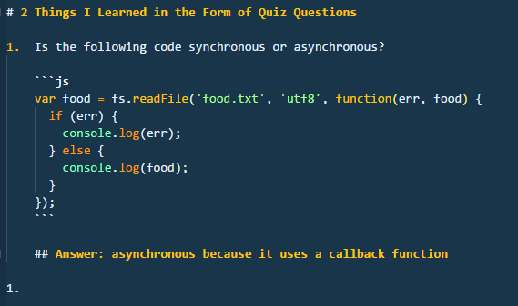
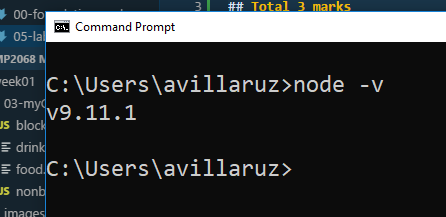

# Lab 1 - Getting Started with Github :smiley:

## Total 3 marks

This lab is to introduce you to Github's markdown language as well as give me a quick assessment of today's class. To complete the lab:

1.  Create a new repository called Lab 1
1.  Create a new file called `##lab1.md` but replace `##` with your initials (0.25 marks)
1.  Open a browser tab to [Markdown Guide](https://guides.github.com/features/mastering-markdown/) to refer to when you need to.
1.  Type the following markdown code into your empty .md file (0.5 marks)
    
1.  Using the above as a template, use markdown (not HTML tags) to fill in the 2nd question of whatever you learned today in the form of a quiz question (0.25 marks)
1.  Include similar code fencing by using markdown's triple backticks followed by the name of the language you're using to better illustrate your quiz question (0.25 marks)1. Include the answer in the form of an h2 heading (using markdown) followed by a brief explanation of the answer. (0.25 marks)
1.  Make an h1 heading (using markdown) titled, "2 Questions I still have are..." (0.25 marks)
1.  In the form of a bulleted list (using markdown) enter your 2 questions (0.25 marks)
1.  Open your command prompt, navigate to your home folder `C:>\Users\avillaruz>` then type: `node -v`, take a screenshot of that, insert it (via markdown) as a picture (1 mark)
1.  Upload your .md file to Github and submit your Lab1 repository link on Blackboard

# 2 Things I Learned in the Form of Quiz Questions

1.  Is the following code synchronous or asynchronous?

    ```js
    var food = fs.readFile('food.txt', 'utf8', function(err, food) {
      if (err) {
        console.log(err);
      } else {
        console.log(food);
      }
    });
    ```

    ## Answer: asynchronous because it uses a callback function

1.  [Insert your 2nd question here]

    ```js
    ```

    ## [insert answer here]

    # 2 Questions I still have are...

    * ...
    * ...

1.  
